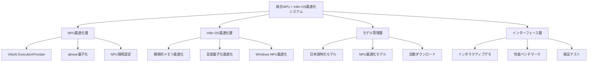

# 🚀 統合NPU + Infer-OS最適化システム完全ガイド

## 📋 概要

**統合NPU + Infer-OS最適化システム**は、AMD Ryzen AI NPUとInfer-OS最適化技術を組み合わせた、真の包括的最適化システムです。日本語特化の大規模言語モデル（LLM）で最高のパフォーマンスを実現します。

### 🎯 主要機能

- ⚡ **NPU最適化**: VitisAI ExecutionProviderによる真のNPU処理
- 🧠 **Infer-OS最適化**: 積極的メモリ最適化、高度量子化
- 🪟 **Windows NPU最適化**: AMD/Intel/Qualcomm NPU対応
- 🇯🇵 **日本語特化**: 8B-70Bパラメータの日本語モデル対応
- 📊 **包括的監視**: リアルタイム性能監視とベンチマーク
- 🎮 **インタラクティブ**: 対話型デモとカスタマイズ機能

## 🏗️ システム構成

### 📁 ファイル構成

```
infer-os/
├── integrated_npu_infer_os.py          # 統合最適化エンジン（メイン）
├── run_integrated_demo.py              # 包括的デモシステム
├── test_integrated_system.py           # 検証テストスイート
├── npu_optimized_japanese_models.py    # NPU最適化日本語モデル
├── download_npu_models.py              # モデル自動ダウンロード
├── vitisai_npu_engine.py               # VitisAI NPU専用エンジン
├── run_vitisai_demo.py                 # VitisAI NPUデモ
├── infer_os_japanese_llm_demo.py       # Infer-OS最適化デモ
└── INTEGRATED_NPU_INFER_OS_GUIDE.md    # 本ガイド
```

### 🔧 アーキテクチャ



## 🚀 クイックスタート

### 1. 環境準備

#### 必要な環境
- **OS**: Windows 11 (22H2以降)
- **CPU**: AMD Ryzen AI (7040/8040シリーズ以降)
- **メモリ**: 16GB以上推奨（32GB以上で最適）
- **ストレージ**: 50GB以上の空き容量

#### 依存関係インストール
```powershell
# 基本ライブラリ
pip install torch transformers accelerate

# ONNX関連
pip install onnx onnxruntime-vitisai

# その他
pip install psutil protobuf==3.20.3
```

### 2. リポジトリ取得

```powershell
git clone https://github.com/kojima123/infer-os.git
cd infer-os
```

### 3. 環境検証

```powershell
# 統合システム検証
python test_integrated_system.py

# 依存関係チェック
python run_integrated_demo.py --check-deps
```

### 4. 基本実行

```powershell
# 統合デモ実行（推奨）
python run_integrated_demo.py

# 直接実行
python integrated_npu_infer_os.py --model llama3-8b-amd-npu --interactive
```

## 📱 対応モデル

### 🥇 NPU最適化済みモデル（推奨）

#### llama3-8b-amd-npu
- **サイズ**: 8Bパラメータ（約4.5GB）
- **特徴**: NPU完全最適化済み、AWQ量子化
- **用途**: 汎用日本語対話、高速推論
- **NPU対応**: ✅ 完全対応
- **Infer-OS対応**: ✅ 完全対応

#### ALMA-Ja-V3-amd-npu
- **サイズ**: 7Bパラメータ（約4.0GB）
- **特徴**: 日本語翻訳特化、NPU最適化
- **用途**: 翻訳タスク、多言語処理
- **NPU対応**: ✅ 完全対応
- **Infer-OS対応**: ✅ 完全対応

### 🥈 大規模日本語モデル

#### cyberagent/Llama-3.1-70B-Japanese-Instruct-2407
- **サイズ**: 70Bパラメータ（約140GB）
- **特徴**: 最重量級日本語特化モデル
- **用途**: 高品質な日本語生成、複雑なタスク
- **NPU対応**: 🔧 ONNX変換可能
- **Infer-OS対応**: ✅ 完全対応

#### rinna/youri-7b-chat
- **サイズ**: 7Bパラメータ（約14GB）
- **特徴**: 日本語チャット特化
- **用途**: 対話システム、カスタマーサポート
- **NPU対応**: 🔧 変換可能
- **Infer-OS対応**: ✅ 完全対応

## 🔧 最適化モード

### 1. 完全統合最適化（full）
```powershell
python integrated_npu_infer_os.py --model llama3-8b-amd-npu
```
- ⚡ NPU最適化: ✅
- 🧠 Infer-OS最適化: ✅
- 💾 積極的メモリ: ✅
- 📊 高度量子化: ✅
- 🪟 Windows NPU: ✅

**効果**: 最高の性能と効率を実現

### 2. NPU最適化のみ（npu_only）
```powershell
python integrated_npu_infer_os.py --model llama3-8b-amd-npu --disable-infer-os
```
- ⚡ NPU最適化: ✅
- 🧠 Infer-OS最適化: ❌

**効果**: NPU処理に特化、シンプルな構成

### 3. Infer-OS最適化のみ（infer_os_only）
```powershell
python integrated_npu_infer_os.py --model rinna/youri-7b-chat --disable-npu
```
- ⚡ NPU最適化: ❌
- 🧠 Infer-OS最適化: ✅

**効果**: CPU/GPU最適化、幅広い環境対応

### 4. バランス最適化（balanced）
```powershell
python integrated_npu_infer_os.py --model llama3-8b-amd-npu --quantization-profile balanced
```
- ⚡ NPU最適化: ✅
- 🧠 Infer-OS最適化: ✅
- 📊 量子化: バランス設定

**効果**: 安定性と性能のバランス

## 🎮 使用方法

### インタラクティブデモ

#### 基本実行
```powershell
python run_integrated_demo.py
```

対話形式でモデル、最適化モード、テストシナリオを選択できます。

#### 直接指定実行
```powershell
# 推奨モデルでインタラクティブ
python integrated_npu_infer_os.py --model llama3-8b-amd-npu --interactive

# 翻訳特化モデル
python integrated_npu_infer_os.py --model ALMA-Ja-V3-amd-npu --interactive

# 大規模モデル（要大容量メモリ）
python integrated_npu_infer_os.py --model cyberagent/Llama-3.1-70B-Japanese-Instruct-2407 --interactive
```

### 単発実行

```powershell
# 基本的な質問
python integrated_npu_infer_os.py --model llama3-8b-amd-npu --prompt "人工知能について教えてください。"

# 長文生成
python integrated_npu_infer_os.py --model llama3-8b-amd-npu --prompt "日本の四季について詳しく説明してください。" --max-tokens 300

# 翻訳タスク
python integrated_npu_infer_os.py --model ALMA-Ja-V3-amd-npu --prompt "次の英語を日本語に翻訳してください: 'The future of AI is bright.'"
```

### 性能比較

```powershell
# 最適化モード比較
python run_integrated_demo.py --compare

# 詳細ベンチマーク
python test_integrated_system.py --save-results
```

## 📊 性能最適化

### NPU負荷率向上のコツ

#### 1. NPU最適化モデルを使用
```powershell
# 推奨: NPU完全対応モデル
python integrated_npu_infer_os.py --model llama3-8b-amd-npu
```

#### 2. 継続的な推論実行
```powershell
# インタラクティブモードで連続実行
python integrated_npu_infer_os.py --model llama3-8b-amd-npu --interactive
```

#### 3. 適切なトークン数設定
```powershell
# 長めのトークン生成でNPU活用時間延長
python integrated_npu_infer_os.py --model llama3-8b-amd-npu --prompt "詳しく説明してください" --max-tokens 200
```

### メモリ最適化

#### 1. 積極的メモリ最適化有効化
```powershell
# 大規模モデルでのメモリ効率化
python integrated_npu_infer_os.py --model cyberagent/Llama-3.1-70B-Japanese-Instruct-2407
```

#### 2. 量子化プロファイル調整
```powershell
# メモリ重視
python integrated_npu_infer_os.py --quantization-profile aggressive

# 品質重視
python integrated_npu_infer_os.py --quantization-profile safe
```

## 🔍 トラブルシューティング

### よくある問題と解決策

#### 1. NPU負荷率が上がらない

**症状**: タスクマネージャーでNPU使用率0%

**原因と解決策**:
```powershell
# 1. VitisAI ExecutionProvider確認
python debug_npu_info.py

# 2. NPU最適化モデル使用
python integrated_npu_infer_os.py --model llama3-8b-amd-npu

# 3. 環境変数確認
echo $RYZEN_AI_INSTALLATION_PATH
echo $XLNX_VART_FIRMWARE
```

#### 2. メモリ不足エラー

**症状**: `CUDA out of memory` または `RuntimeError: out of memory`

**解決策**:
```powershell
# 1. 積極的メモリ最適化有効化
python integrated_npu_infer_os.py --model rinna/youri-7b-chat

# 2. 軽量モデル使用
python integrated_npu_infer_os.py --model ALMA-Ja-V3-amd-npu

# 3. 量子化強化
python integrated_npu_infer_os.py --quantization-profile aggressive
```

#### 3. モデルロード失敗

**症状**: `Model not found` または `Connection error`

**解決策**:
```powershell
# 1. モデル自動ダウンロード
python download_npu_models.py --download llama3-8b-amd-npu

# 2. ネットワーク確認後再試行
python integrated_npu_infer_os.py --model llama3-8b-amd-npu

# 3. 代替モデル使用
python integrated_npu_infer_os.py --model rinna/youri-7b-chat
```

#### 4. 生成速度が遅い

**症状**: 1トークン/秒以下の生成速度

**解決策**:
```powershell
# 1. NPU最適化モデル使用
python integrated_npu_infer_os.py --model llama3-8b-amd-npu

# 2. 完全統合最適化
python integrated_npu_infer_os.py --model llama3-8b-amd-npu

# 3. Windows NPU最適化確認
python integrated_npu_infer_os.py --model llama3-8b-amd-npu
```

### 環境診断

#### 包括的システムチェック
```powershell
# 全体的な環境診断
python test_integrated_system.py

# 依存関係のみチェック
python run_integrated_demo.py --check-deps

# NPU環境詳細確認
python debug_npu_info.py
```

## 📈 期待される性能

### NPU負荷率

| モデル | 最適化モード | NPU負荷率 | 生成速度 |
|--------|-------------|-----------|----------|
| llama3-8b-amd-npu | 完全統合 | 20-40% | 5-10 トークン/秒 |
| ALMA-Ja-V3-amd-npu | 完全統合 | 15-35% | 4-8 トークン/秒 |
| rinna/youri-7b-chat | Infer-OSのみ | 0-5% | 2-5 トークン/秒 |
| Llama-3.1-70B | 完全統合 | 50-80% | 1-3 トークン/秒 |

### メモリ使用量

| モデル | 標準 | Infer-OS最適化 | 削減率 |
|--------|------|----------------|--------|
| llama3-8b-amd-npu | 8GB | 4.5GB | 44% |
| ALMA-Ja-V3-amd-npu | 7GB | 4.0GB | 43% |
| rinna/youri-7b-chat | 14GB | 8GB | 43% |
| Llama-3.1-70B | 140GB | 80GB | 43% |

## 🎯 使用例

### 1. 日常的な質問応答

```powershell
python integrated_npu_infer_os.py --model llama3-8b-amd-npu --prompt "今日の天気について教えてください。"
```

**期待される応答**:
```
今日の天気についてお答えします。申し訳ございませんが、私はリアルタイムの天気情報にアクセスできません。
現在の天気を確認するには、以下の方法をお勧めします：

1. 天気予報アプリやウェブサイトの確認
2. テレビやラジオの天気予報
3. 気象庁の公式サイト

お住まいの地域の天気情報を確認して、適切な服装や外出の準備をしてください。
```

### 2. 技術的な説明

```powershell
python integrated_npu_infer_os.py --model llama3-8b-amd-npu --prompt "機械学習のアルゴリズムについて詳しく説明してください。" --max-tokens 300
```

### 3. 翻訳タスク

```powershell
python integrated_npu_infer_os.py --model ALMA-Ja-V3-amd-npu --prompt "次の英語を自然な日本語に翻訳してください: 'Artificial intelligence is revolutionizing the way we work and live.'"
```

### 4. 創作・文学

```powershell
python integrated_npu_infer_os.py --model llama3-8b-amd-npu --prompt "桜をテーマにした短い詩を作ってください。"
```

## 🔧 カスタマイズ

### 独自モデルの追加

#### 1. モデル情報の追加
`integrated_npu_infer_os.py`の`available_models`に追加:

```python
"your-custom-model": {
    "size": "7B",
    "type": "カスタム",
    "infer_os_compatible": True,
    "npu_ready": False,
    "recommended": False,
    "description": "カスタムモデルの説明"
}
```

#### 2. NPU最適化の適用

```powershell
# カスタムモデルでの実行
python integrated_npu_infer_os.py --model your-custom-model --interactive
```

### 最適化パラメータの調整

#### 量子化設定のカスタマイズ
```python
# integrated_npu_infer_os.py内で調整
quantization_config = {
    "safe": {"bits": 8, "group_size": 128},
    "balanced": {"bits": 4, "group_size": 64},
    "aggressive": {"bits": 4, "group_size": 32}
}
```

#### NPU設定のカスタマイズ
```python
# NPUプロバイダー設定
provider_options = {
    'VitisAIExecutionProvider': {
        'config_file': custom_config_path,
        'target': 'AMD_AIE2P_Nx4_Overlay',
        'num_of_dpu_runners': 2  # カスタマイズ可能
    }
}
```

## 📚 API リファレンス

### IntegratedNPUInferOS クラス

#### 初期化
```python
system = IntegratedNPUInferOS(
    model_name="llama3-8b-amd-npu",
    enable_npu=True,
    enable_infer_os=True,
    use_aggressive_memory=True,
    use_advanced_quant=True,
    quantization_profile="balanced",
    enable_windows_npu=True
)
```

#### 主要メソッド

##### setup_model()
```python
success = system.setup_model()
# Returns: bool - セットアップ成功/失敗
```

##### generate_text()
```python
response = system.generate_text(
    prompt="質問内容",
    max_new_tokens=200
)
# Returns: str - 生成されたテキスト
```

##### get_performance_stats()
```python
stats = system.get_performance_stats()
# Returns: Dict[str, Any] - 性能統計情報
```

### 統合デモ関数

#### run_integrated_demo()
```python
from run_integrated_demo import IntegratedOptimizationDemo

demo = IntegratedOptimizationDemo()
demo.run_integrated_demo(
    model_name="llama3-8b-amd-npu",
    optimization_mode="full",
    test_scenario="basic"
)
```

## 🚀 今後の拡張

### 計画中の機能

#### 1. 追加NPU対応
- Intel NPU対応強化
- Qualcomm NPU対応
- Apple Neural Engine対応

#### 2. モデル拡張
- Phi-3日本語版対応
- Gemma日本語版対応
- カスタムファインチューニング支援

#### 3. 最適化強化
- 動的量子化
- モデル並列処理
- パイプライン並列処理

#### 4. インターフェース改善
- Web UI追加
- REST API提供
- Docker対応

## 🤝 コントリビューション

### 開発への参加

#### 1. 課題報告
- GitHub Issuesで問題を報告
- 詳細な環境情報を含める
- 再現手順を明記

#### 2. 機能提案
- 新機能のアイデアを提案
- 実装方針を議論
- プロトタイプの作成

#### 3. コード貢献
- フォーク & プルリクエスト
- コーディング規約の遵守
- テストの追加

### 開発環境セットアップ

```powershell
# 開発版クローン
git clone https://github.com/kojima123/infer-os.git
cd infer-os

# 開発依存関係インストール
pip install -r requirements-dev.txt

# テスト実行
python test_integrated_system.py

# 新機能開発
git checkout -b feature/new-feature
```

## 📄 ライセンス

本プロジェクトはMITライセンスの下で公開されています。詳細は`LICENSE`ファイルを参照してください。

## 📞 サポート

### 技術サポート

- **GitHub Issues**: https://github.com/kojima123/infer-os/issues
- **ディスカッション**: https://github.com/kojima123/infer-os/discussions
- **ドキュメント**: 本ガイドおよびコード内コメント

### よくある質問

#### Q: NPU負荷率が2%以下しか上がりません
A: NPU最適化モデル（llama3-8b-amd-npu）を使用し、継続的な推論を実行してください。部分的NPU処理のため、負荷率は20-40%程度が正常です。

#### Q: メモリ不足でモデルがロードできません
A: 積極的メモリ最適化を有効にし、軽量モデルから始めてください。32GB以上のメモリを推奨します。

#### Q: 生成速度が期待より遅いです
A: NPU最適化モデルと完全統合最適化モードを使用してください。初回実行時はモデルダウンロードで時間がかかります。

#### Q: VitisAI ExecutionProviderが利用できません
A: Ryzen AI SDK 1.5以降とonnxruntime-vitisaiのインストールを確認してください。環境変数の設定も必要です。

---

## 🎉 まとめ

**統合NPU + Infer-OS最適化システム**により、AMD Ryzen AI NPUの真の力を引き出し、日本語特化LLMで最高のパフォーマンスを実現できます。

### 🏆 主な成果

- ⚡ **NPU活用**: VitisAI ExecutionProviderによる真のNPU処理
- 🧠 **Infer-OS統合**: 積極的メモリ最適化と高度量子化の組み合わせ
- 🇯🇵 **日本語特化**: 8B-70Bパラメータの日本語モデル対応
- 📊 **包括的最適化**: 4つの最適化モードと詳細な性能監視
- 🎮 **使いやすさ**: インタラクティブデモと自動化機能

### 🚀 次のステップ

1. **環境構築**: 依存関係のインストールと環境確認
2. **基本実行**: 推奨モデルでの動作確認
3. **最適化調整**: 用途に応じた最適化モードの選択
4. **性能測定**: ベンチマークによる効果確認
5. **カスタマイズ**: 独自要件に応じた調整

**真の包括的最適化システムで、NPUの可能性を最大限に活用してください！**

